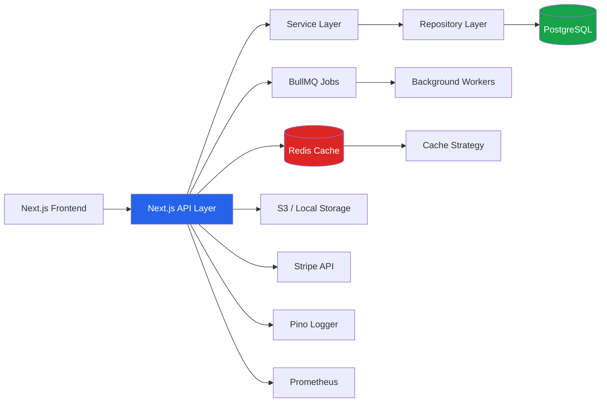
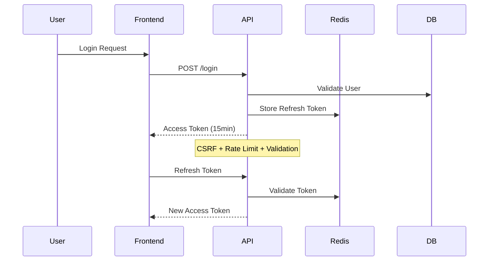

 ```mermaid
gantt
    title 3-Month Enterprise CMS Execution Plan
    dateFormat  YYYY-MM-DD
    section Phase 1 - Foundation
    Week 1 - Setup & Infra           :a1, 2026-01-01, 7d
    Week 2 - Auth + RBAC             :a2, after a1, 7d
    Week 3 - Core Infrastructure     :a3, after a2, 7d

    section Phase 2 - Core Modules
    Week 4 - User & Roles            :b1, after a3, 7d
    Week 5 - Student/Teacher Module  :b2, after b1, 7d
    Week 6 - Courses + Exams         :b3, after b2, 7d
    Week 7 - Payment System          :b4, after b3, 7d

    section Phase 3 - Advanced Features
    Week 8 - Realtime + Caching      :c1, after b4, 7d
    Week 9 - Performance + Scaling   :c2, after c1, 7d
    Week 10 - Monitoring + Metrics   :c3, after c2, 7d

    section Phase 4 - Production
    Week 11 - Docker + Nginx         :d1, after c3, 7d
    Week 12 - Hardening + CI/CD      :d2, after d1, 7d

 ```

 ```mermaid
 flowchart TD

    A[Phase 1<br>Foundation] --> B[Secure Backend Base]
    B --> C[Phase 2<br>Core Modules]
    C --> D[Business Logic Complete]
    D --> E[Phase 3<br>Advanced Systems]
    E --> F[Enterprise Optimization]
    F --> G[Phase 4<br>Deployment + Hardening]
    G --> H[Production Ready System]

    style A fill:#1f2937,color:#fff
    style C fill:#1f2937,color:#fff
    style E fill:#1f2937,color:#fff
    style G fill:#1f2937,color:#fff
```



